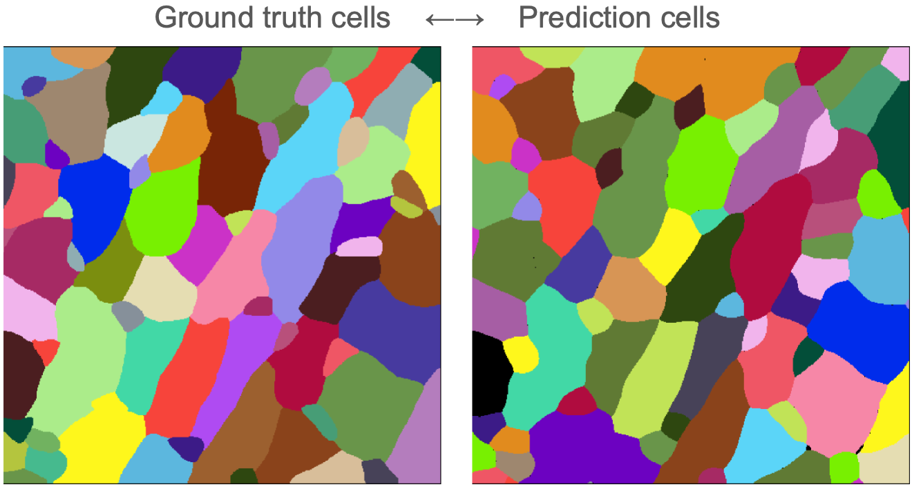
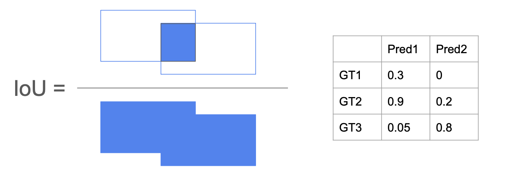
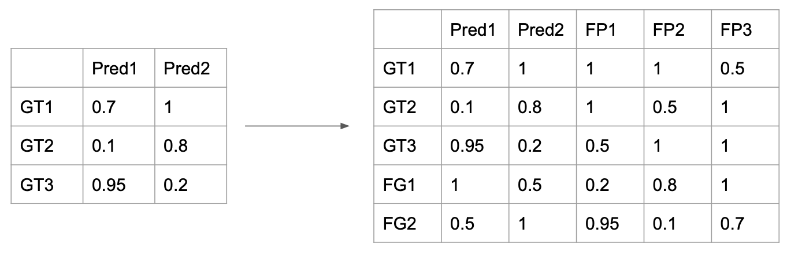
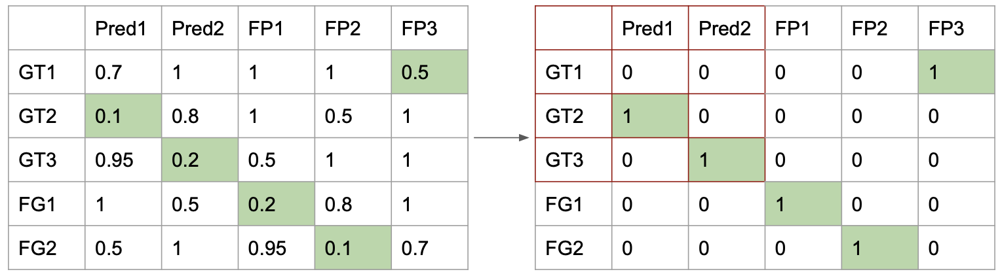

# Detailed description of Segobe functionality

## Overview

* **Start:** Label-images of ground truth and prediction cells

* **Goals:**
  * Segmentation error type counts: True Positives (TP), False Positives (FP), False Negatives (FN), Merges, Splits, Catastrophes
  * Segmentation evaluation metrics: mean IoU, mean Dice, precision, recall, F1 score
  
## Cell matching

* Calculate the IoU between all GT (N) and PRED (M) pairs

* Construct the cost matrix:
  * `1 - IoU` (default)
  * `1 - Dice` (optional)
  * `1 - MOC` - Mean overlap coefficient defined as: `(Intersection / GT + Intersection / Prediction) / 2` (optional)
* Pad the NxM matrix to (N+M)x(M+N) to allow for an unassigned cost penalty (default 0.5)

* Apply the Hungarian method (Linear sum assignment problem) to find top matches (lowest cost)

## Counting segmentation errors

* If the detected pair has an IoU above a predefined threshold (`iou_threshold`, e.g. 0.5), it is counted as a match - **True Positive**.
  * GT2 ←→ Pred1: IoU = 0.9 → match!
  * GT3 ←→ Pred2: IoU = 0.8 → match!
* Remaining GT and Prediction cells are used to build a graph with an edge if their IoU is above a threshold (`graph_iou_threshold`, e.g. 0.1).
* Ground truth cells without matches are labeled as **False Negatives** (FNs)
  * GT1 from previous example
* Prediction cells without matches are labeled as **False Positives** (FPs)
* Multiple GT cells connected to a prediction is a **Merge**
* Multiple Prediction cells connected to a GT cell is a **Split**
* Multiple GT cells connected to multiple Prediction cells constitutes a **Catastrophe**

> **Note:** If more than 2 Predictions match a GT cell or vice versa, they are counted as either a Merge or Split, not a Catastrophe
> 
> See Supplementary Figure 2. of [Schwartz **et al.** 2024](https://doi.org/10.1101/803205) for a visual example.

## Segmentation evaluation metrics

* These are calculated per image, not across all cells
* Calculated only across True Positive pairs
  * Mean IoU = Mean of Intersection / Union values
  * Mean Dice = Mean of 2 * Intersection / (Area sum of GT and Prediction) values 
  * Precision = TP / (TP + FP)
  * Recall = TO / (TP + FN)
  * F1 = 2 * Precision * Recall / (Precision + Recall)

## Open questions
* What is the best approach for cell matching
  1. cost matrix choice for linear sum assignment
     * 1 - IoU
     * 1 - Dice
     * 1 - MOC
  2. Graph construction already only based on overlap thresholds (directional)
* Counting segmentation errors - should matched cells be excluded?
  * excluding nodes from the graph can lead to missed segmentation errors (merges, splits, catastrophes)
  * including the nodes would place "correct matches" within an error context
* Should merges and splits be treated as single objects for IoU and Dice measurements to capture shape of cells, while acknowledging over/undersegmentation?
* Excluding cells on edges needs to be a feature
* Are events involving 4 nodes always catastrophes? Here it is not implemented, and wording in original papers was imprecise.
* Parameter choice and impact on results